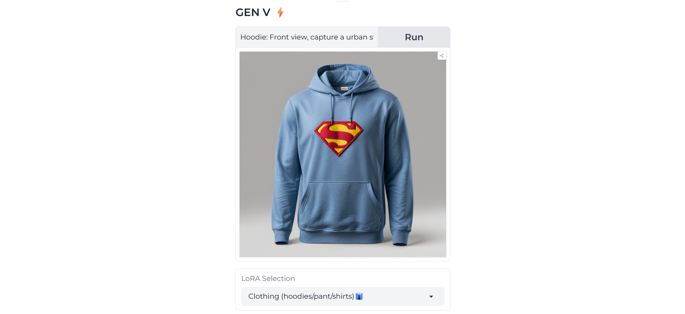
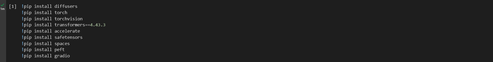
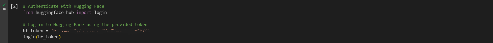
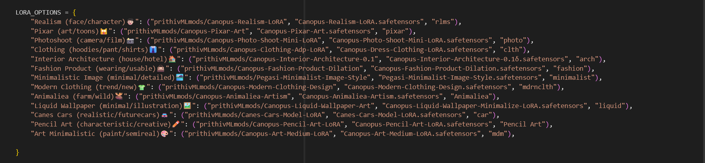
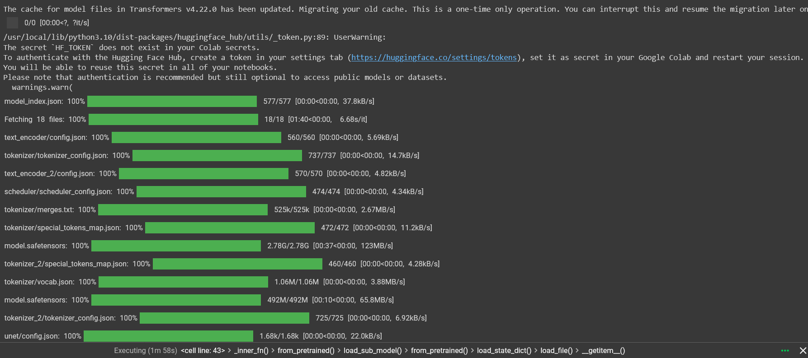
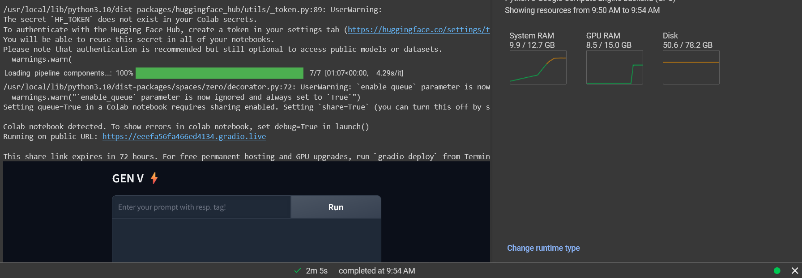
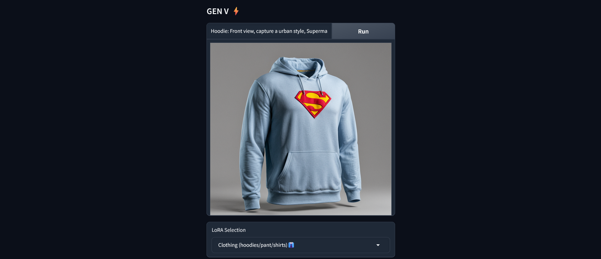
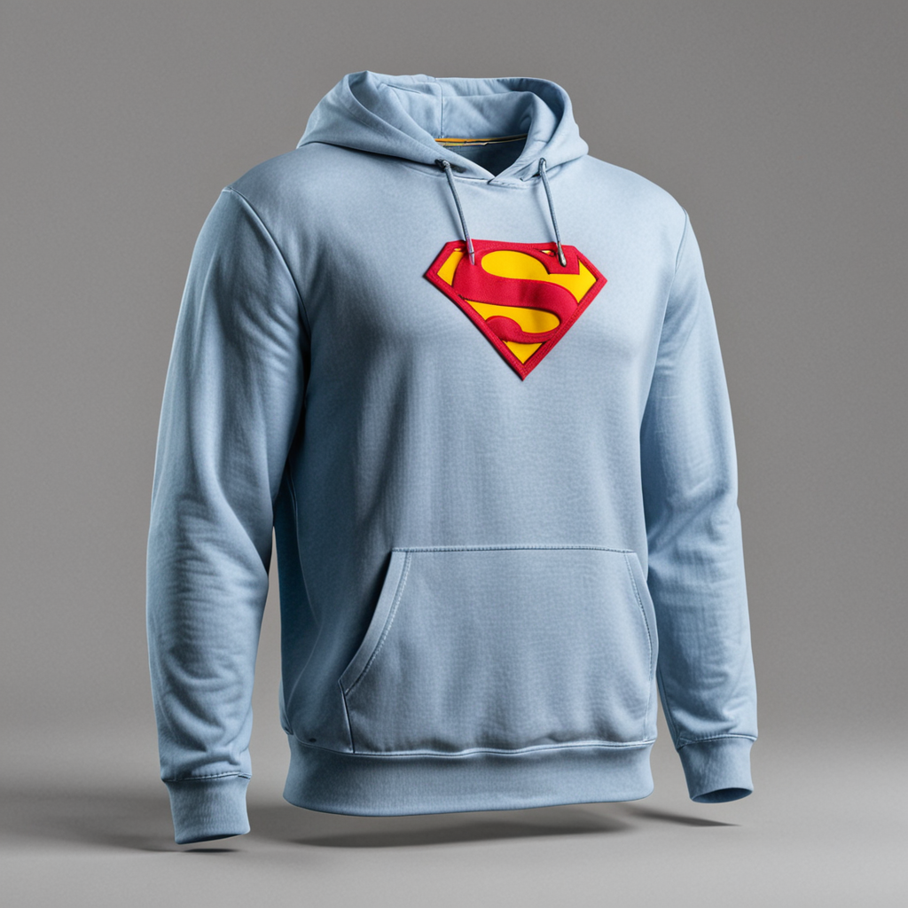
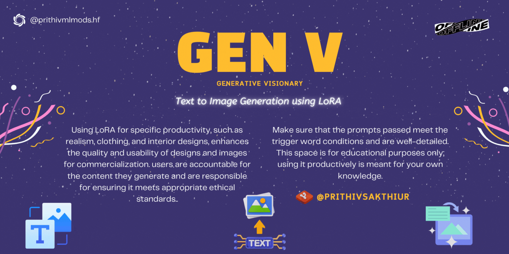

Check out the configuration reference at https://huggingface.co/docs/hub/spaces-config-reference

## GITLFS

    # Make sure you have git-lfs installed (https://git-lfs.com)
    git lfs install
    
    git clone https://huggingface.co/spaces/prithivMLmods/Midjour-AI
    
    # If you want to clone without large files - just their pointers
    
    GIT_LFS_SKIP_SMUDGE=1 git clone https://huggingface.co/spaces/prithivMLmods/Midjour-AI
    
## SSH
    
    # Make sure you have git-lfs installed (https://git-lfs.com)
    git lfs install
    
    git clone git@hf.co:spaces/prithivMLmods/Midjour-AI
    
    # If you want to clone without large files - just their pointers
    
    GIT_LFS_SKIP_SMUDGE=1 git clone git@hf.co:spaces/prithivMLmods/Midjour-AI

-------------------------------------------------------------------------------------------------------------

## Colab ⚡

Installing all the requirements ( requirements.txt )

Authentication & Huggingface Login ( pass your Access token from HF )

Attached Models Loaded

Loading LoRA Models

Launched in Gradio

Running Sample

Results #prompt : Hoodie: Front view, capture a urban style, Superman Hoodie, technical materials, fabric small point label on text Blue theory, the design is minimal, with a raised collar, fabric is a Light yellow, low angle to capture the Hoodies form and detailing, f/5.6 to focus on the hoodies craftsmanship, solid grey background, studio light setting, with batman logo in the chest region of the t-shirt

.

.

.

## Dependencies

| Package        | Version       |
|----------------|---------------|
| `diffusers`    | latest        |
| `torch`        | latest        |
| `torchvision`  | latest        |
| `pipeline`     | latest        |
| `transformers` | 4.43.3        |
| `accelerate`   | latest        |
| `safetensors`  | latest        |
| `spaces`       | latest        |
| `peft`         | latest        |
| `gradio`       | latest        |

------------------------------------------------------------------------------------------------------------------------------------------------------------------------------

----------------------------------------------------------------------------------------------------------------------------------------------------------------------------

LORA USED

| Option                               | Repository URL                                       | File Name                                      | Alias        |
|--------------------------------------|------------------------------------------------------|------------------------------------------------|--------------|
| Realism (face/character) 👦🏻          | `prithivMLmods/Canopus-Realism-LoRA`                 | `Canopus-Realism-LoRA.safetensors`             | `rlms`       |
| Pixar (art/toons) 🙀                 | `prithivMLmods/Canopus-Pixar-Art`                    | `Canopus-Pixar-Art.safetensors`                | `pixar`      |
| Photoshoot (camera/film) 📸          | `prithivMLmods/Canopus-Photo-Shoot-Mini-LoRA`        | `Canopus-Photo-Shoot-Mini-LoRA.safetensors`    | `photo`      |
| Clothing (hoodies/pants/shirts) 👔   | `prithivMLmods/Canopus-Clothing-Adp-LoRA`            | `Canopus-Dress-Clothing-LoRA.safetensors`      | `clth`       |
| Interior Architecture (house/hotel) 🏠 | `prithivMLmods/Canopus-Interior-Architecture-0.1`    | `Canopus-Interior-Architecture-0.1δ.safetensors` | `arch`       |
| Fashion Product (wearing/usable) 👜  | `prithivMLmods/Canopus-Fashion-Product-Dilation`     | `Canopus-Fashion-Product-Dilation.safetensors` | `fashion`    |
| Minimalistic Image (minimal/detailed) 🏞️ | `prithivMLmods/Pegasi-Minimalist-Image-Style`        | `Pegasi-Minimalist-Image-Style.safetensors`    | `minimalist` |
| Modern Clothing (trend/new) 👕       | `prithivMLmods/Canopus-Modern-Clothing-Design`       | `Canopus-Modern-Clothing-Design.safetensors`   | `mdrnclth`   |
| Animaliea (farm/wild) 🫎             | `prithivMLmods/Canopus-Animaliea-Artism`             | `Canopus-Animaliea-Artism.safetensors`         | `Animaliea`  |
| Liquid Wallpaper (minimal/illustration) 🖼️ | `prithivMLmods/Canopus-Liquid-Wallpaper-Art`         | `Canopus-Liquid-Wallpaper-Minimalize-LoRA.safetensors` | `liquid`     |
| Canes Cars (realistic/future cars) 🚘 | `prithivMLmods/Canes-Cars-Model-LoRA`                | `Canes-Cars-Model-LoRA.safetensors`            | `car`        |
| Pencil Art (characteristic/creative) ✏️ | `prithivMLmods/Canopus-Pencil-Art-LoRA`               | `Canopus-Pencil-Art-LoRA.safetensors`          | `Pencil Art` |
| Art Minimalistic (paint/semireal) 🎨 | `prithivMLmods/Canopus-Art-Medium-LoRA`              | `Canopus-Art-Medium-LoRA.safetensors`          | `mdm`        |

-----------------------------------------------------------------------------------------------------------------------------------------------------------------------------------------------------

